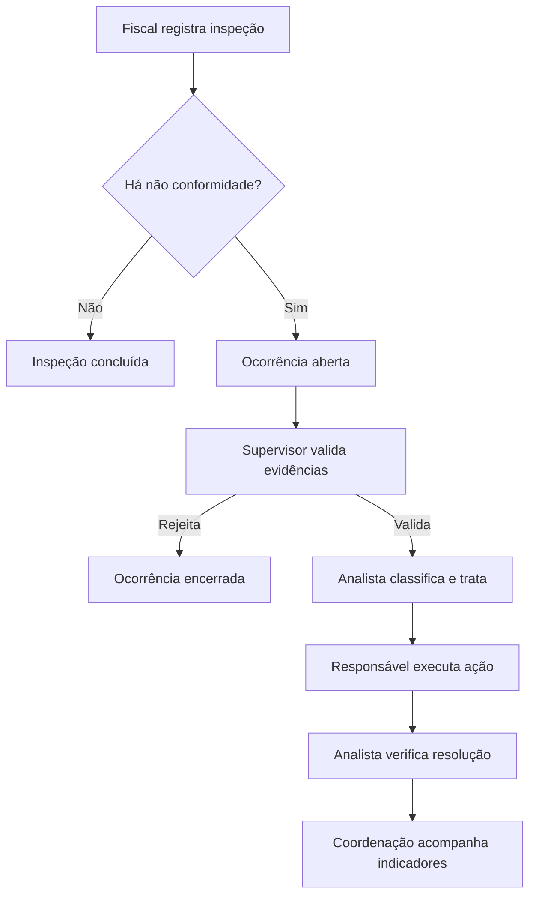

# Especificação funcional e técnica — AeroOps BH

## 1. Objetivo

Substituir formulários dispersos e consolidações manuais por uma aplicação web responsiva que permita executar inspeções em campo, validar ocorrências, tratar irregularidades e gerar indicadores confiáveis da operação aeroportuária.

## 2. Perfis e permissões

| Ação | Fiscal | Supervisor | Analista | Coordenação |
|---|:---:|:---:|:---:|:---:|
| Criar e enviar inspeção | ✓ | ✓ | — | — |
| Editar rascunho próprio | ✓ | ✓ | — | — |
| Validar/rejeitar ocorrência | — | ✓ | — | — |
| Registrar recurso, pontuação e tratamento | — | — | ✓ | — |
| Consultar inspeções e histórico | Próprias | Todas | Todas | Todas |
| Ver dashboard | Resumido | ✓ | ✓ | ✓ |
| Administrar cadastros e usuários | — | — | — | ✓ |

## 3. Tela: nova inspeção de pátio

### Cabeçalho

- protocolo automático e imutável;
- data/hora de início automáticas;
- fiscal preenchido pelo usuário autenticado;
- aeroporto, pátio/setor, turno e condições climáticas;
- quadrícula selecionada no mapa e localização textual complementar.

### Checklist

Cada item possui `Conforme`, `Não conforme` ou `Não se aplica`, observação e evidências.

1. organização geral do pátio;
2. pontes de embarque;
3. pavimento/concreto;
4. posições de aeronaves e marcações;
5. sinalização horizontal e vertical;
6. credenciais visíveis;
7. equipamentos irregulares;
8. equipamentos mínimos na posição;
9. excesso de equipamentos;
10. FOD, obstáculos ou objetos soltos;
11. indícios de fauna ou risco operacional.

### Regras indispensáveis

- item não conforme exige descrição, gravidade, quadrícula e ao menos uma foto;
- funcionamento offline deve entrar na próxima etapa para uso em áreas com sinal instável;
- data, autor e mudanças de status não podem ser alterados manualmente;
- inspeção enviada fica bloqueada; correções são feitas por versão/adendo;
- localização pode ser escolhida num mapa de quadrículas, sem digitação obrigatória;
- rascunho deve ser salvo automaticamente;
- fotos devem registrar data e, quando autorizado, coordenada do dispositivo;
- ações sensíveis devem integrar a trilha de auditoria.

## 4. Fluxo operacional



O supervisor pode consultar câmera ou entrevistar envolvidos antes da decisão. O analista registra empresa, condutor/equipamento, pontuação, comunicação, prazo, recurso e ação corretiva. A coordenação acompanha sem alterar o histórico operacional.

## 5. Telas do MVP

1. **Login:** e-mail, senha e recuperação futura.
2. **Dashboard:** cartões de inspeções, ocorrências abertas, críticas e vencimentos; gráficos por tipo, status, pátio, empresa e fiscal; filtros de período.
3. **Inspeções:** lista, busca, filtros, exportação e botão “Nova inspeção”.
4. **Nova inspeção:** cabeçalho, mapa por quadrícula, checklist, evidências, revisão e envio.
5. **Detalhe da inspeção:** conteúdo bloqueado, fotos, ocorrências geradas e histórico.
6. **Fila de validação:** evidências, decisão, justificativa obrigatória e consulta a histórico.
7. **Tratamento:** classificação, empresa/condutor, pontos, prazo, comunicação, recurso e solução.
8. **Equipamentos:** cadastro, empresa, identificação, última/próxima inspeção e situação.
9. **Mapa operacional:** quadrículas com quantidade e gravidade das ocorrências.
10. **Administração:** usuários, perfis, empresas, pátios, quadrículas e modelos de checklist.

## 6. Wireframe textual principal

```text
┌ Menu ─────────┬ AeroOps / Inspeção de Pátio ────────────────┐
│ Dashboard     │ Pátio [P1] Turno [Tarde] Clima [Seco]       │
│ Inspeções     │ Localização [Mapa: quadrícula 9F]            │
│ Ocorrências   │                                               │
│ Equipamentos  │ Organização geral       [C] [NC] [N/A]      │
│ Mapa          │ Pavimento/concreto      [C] [NC] [N/A]      │
│ Relatórios    │ Credenciais visíveis    [C] [NC] [N/A]      │
│ Administração │ Equipamentos irregulares[C] [NC] [N/A]      │
│               │                                               │
│               │ Observação [____________________________]     │
│               │ Evidências [Adicionar foto]                   │
│               │ [Salvar rascunho]              [Enviar]       │
└───────────────┴───────────────────────────────────────────────┘
```

## 7. Modelo de dados

- `users`: identidade, e-mail, hash, perfil e estado;
- `airports`, `aprons`, `grid_cells`: estrutura e mapa operacional;
- `inspections`: protocolo, fiscal, local, turno, clima, estado e datas;
- `checklist_templates`, `checklist_items`: versão dos formulários;
- `inspection_answers`: resposta, observação e vínculo ao item;
- `occurrences`: origem, classificação, gravidade, estado e responsável;
- `attachments`: arquivo, tipo, hash, autor e data;
- `companies`, `drivers`, `equipment`: entidades fiscalizadas;
- `penalties`, `appeals`: pontuação, decisão e recursos;
- `maintenance_alerts`: validade, prazo e nível do alerta;
- `audit_logs`: ator, ação, entidade, antes/depois e data.

No MVP implementado, as entidades centrais foram reduzidas a `users`, `inspections`, `inspection_answers`, `occurrences`, `equipment` e `audit_logs`, mantendo espaço para evolução sem quebrar o contrato.

## 8. Endpoints

| Método | Rota | Finalidade |
|---|---|---|
| POST | `/auth/login` | Emitir token JWT |
| GET | `/auth/me` | Consultar usuário atual |
| POST | `/inspections` | Criar rascunho |
| GET | `/inspections` | Listar conforme permissão |
| GET | `/inspections/{id}` | Consultar inspeção |
| POST | `/inspections/{id}/submit` | Enviar inspeção |
| GET | `/occurrences` | Consultar fila/ocorrências |
| PATCH | `/occurrences/{id}/status` | Alterar estado conforme perfil |
| GET/POST | `/equipment` | Consultar/cadastrar equipamento |
| GET | `/equipment/alerts` | Consultar inspeções próximas do vencimento |
| GET | `/dashboard/summary` | Indicadores consolidados |

## 9. Indicadores

- inspeções realizadas por dia/mês/ano;
- taxa de não conformidade;
- ocorrências por gravidade, status, categoria, pátio e quadrícula;
- tempo médio entre abertura, validação e resolução;
- itens com maior reincidência;
- produtividade por fiscal sem usar quantidade isolada como avaliação de desempenho;
- empresas/equipamentos com reincidência;
- inspeções de equipamentos vencidas e a vencer em 30 dias.

## 10. Requisitos não funcionais

- interface responsiva para celular e desktop;
- WCAG 2.1 AA, contraste e operação sem depender apenas de cores;
- HTTPS, tokens curtos vinculados a sessões revogáveis, cookies `HttpOnly`, CSRF, MFA TOTP, senhas com Argon2id e autorização no backend;
- anexos em armazenamento de objetos, com antivírus e URL temporária;
- logs imutáveis, backup, retenção e restauração testada;
- LGPD: finalidade, mínimo necessário, controle de acesso e retenção;
- paginação, filtros no servidor e índices para protocolo, status, data e quadrícula;
- observabilidade com logs estruturados, métricas e alertas;
- disponibilidade-alvo e RPO/RTO definidos antes da produção.

## 11. Critérios de aceite essenciais

- fiscal envia inspeção completa pelo celular;
- sistema impede não conformidade sem descrição, gravidade, localização e evidência;
- ocorrência é criada e aparece imediatamente na fila do supervisor;
- apenas supervisor valida/rejeita; apenas analista trata e resolve;
- cada transição registra autor, data e justificativa;
- dashboard respeita filtros e dados persistidos;
- alerta muda automaticamente após nova inspeção válida do equipamento;
- coordenação consulta todos os dados sem editar registros operacionais.

## 12. Próximas iterações

1. upload real de imagens em S3/Azure Blob;
2. PWA offline com sincronização e resolução de conflitos;
3. mapa aeroportuário vetorial e georreferenciamento;
4. notificações por e-mail, push e canais corporativos;
5. pontuação completa, recursos e comitê de avaliação;
6. inspeções de pista, veículos, rádio, limpeza, fauna e obstáculos;
7. importação do histórico do sistema anterior;
8. relatórios PDF/Excel e integração com BI.
